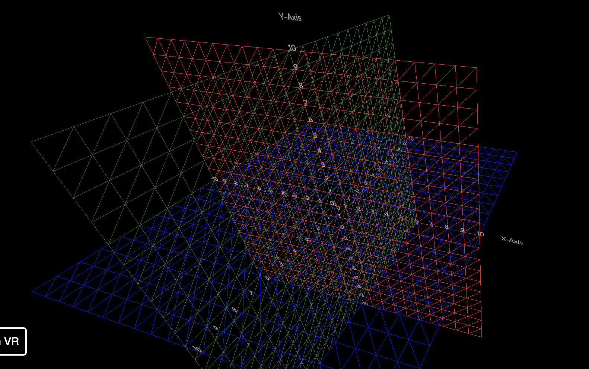

# Demo



# Sample

````
import { GridPlanes } from './src/components/GridPlanes';
  :
      <View>
        <Scene style={{ transform: [{ translate: [15, 15, 15] }] }} />
        <GridPlanes
          ySize={10}
          xSize={20}
          zSize={10}
          style={{
            labels: { color: 'cyan', fontSize: 0.7 },
            planeXY: { color: 'red' },
            planeYZ: { color: 'green' },
            planeZX: { color: 'blue' },
          }}
        />
      </View>
      ```
````
